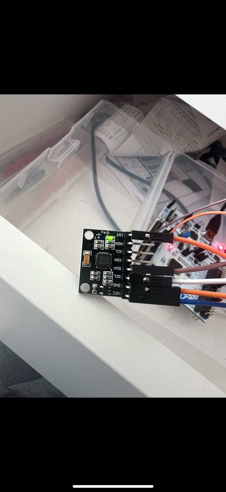
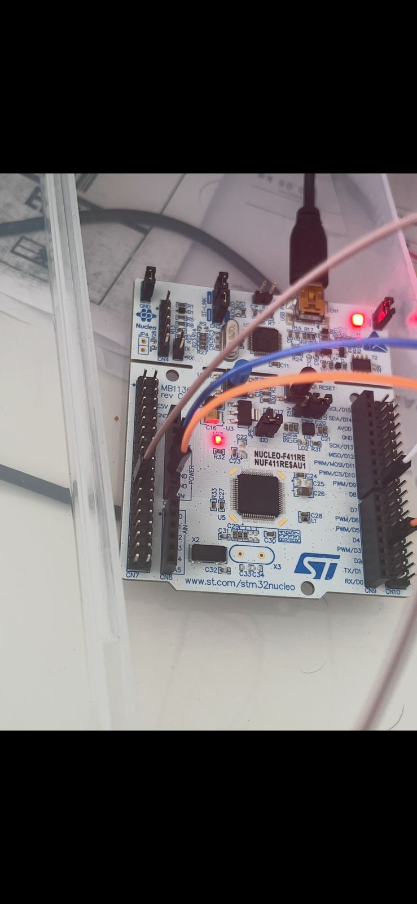

# MPU6050READ-PLOT

This project demonstrates basic communication with an **MPU-6050** IMU sensor using the **STM32F411RE** microcontroller. It reads acceleration and gyroscope data via **I2C** and sends it over **UART**, where it can be visualized using a **serial plotter** (e.g., Arduino IDE serial plotter or any custom plotting tool).

##  Overview

- Microcontroller: **STM32F411RE** (Nucleo board)
- Sensor: **MPU-6050** (3-axis accelerometer + 3-axis gyroscope)
- Communication: **I2C** (MPU6050) + **UART** (data output)
- No libraries like TensorFlow used – pure HAL-based embedded C
- Designed and built using **STM32CubeIDE**
- Plots raw accelerometer and gyro data over time

##  Project Structure

- `Core/`: Main application source code and configuration files.
- `Drivers/`: HAL drivers and sensor interface code.
- `.ioc`: STM32CubeMX configuration file *(optional, not included in this upload)*

##  Output Example

The data output can be directly plotted using a serial plotter tool. You can visualize:
- `Accel_X`, `Accel_Y`, `Accel_Z`
- `Gyro_X`, `Gyro_Y`, `Gyro_Z`

##  Skills Demonstrated

- STM32 peripheral configuration (I2C, UART, GPIO)
- HAL-based driver implementation
- Real-time data acquisition from MPU6050
- Serial communication and data visualization
- STM32CubeIDE workflow

##  How to Use

1. Connect MPU6050 to STM32F411RE:
VCC - 5V
GND - GND
SDA - PB7
SCL - PB6
INT - PB5

2. Flash the project to your STM32 board.

3. Open a serial terminal or plotter at **115200 baud rate**.

4. Observe real-time sensor data plotted over the serial port.

https://drive.google.com/file/d/1KfLnBXQYbBz2KeYIEowQzYJEsujY-CUI/view?usp=sharing

##  Notes

- This project is meant for demonstration purposes.
- The full build files and STM32CubeMX project are omitted in this upload. Only source code (`Core/` and `Drivers/`) is included for review.

